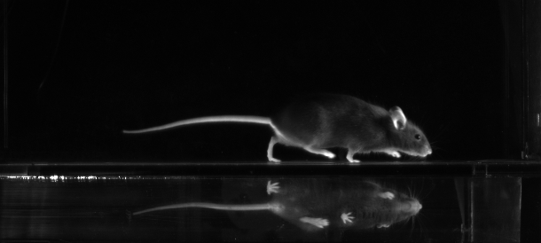

# LocoMouse Tracker v2.0 Development Version

This is a development version meant for members of the Carey lab 
(Champalimaud Foundation, Lisbon, Portugal) to be tweaked and expanded 
to meet the changing requirements for different research projects.

While we are trying to keep this process clean, there is no guarantee that all
bugs have been found after the latest changes were made at the point you are 
downloading it.

The code is currently licenced for non-commercial use only. Other licences can
be arranged on contact with the authors. 

For questions, suggestions or bug reporting please contact 
Dennis Eckmeier (dennis.eckmeier@neuro.fchampalimaud.org), 
Megan Carey, (principal investigator, megan.carey@neuro.fchampalimaud.org),
or the original author Joao Fayad (joaofayad@gmail.com). 

If you find this code useful, please reference it together with the LocoMouse
system paper.

## Intro
LocoMouse_Tracker was developed in MATLAB R2013 for tracking mouse features of 
locomoting mice when observing them from the side and bottom view simultaneously. 
Since then it is being updated for use in later Matlab versions when necessary for 
continued use in the Carey Lab.
It uses Support Vector Machines to learn image filters for each of the features 
and a multi-target tracking framework to resolve the most likely tracks from the 
image observations. This software was developed for specific setup, and so 
replicating such conditions is essential for it to work as intended. The general 
framework is, however, flexible enough to be modified for a different setup. 

Please read the following files before using this code:

- "README" (this file)
- All other license and readme files contained in the "additional_packages"
folder.

## Requirements
Matlab toolboxes:
- Image processing toolbox
- Parallel toolbox (not strictly required, but very slow otherwise).
- Signal processing toolbox
- Statistics toolbox

Additional packages (already included):
- A modified version of:

Efficient Second Order Multi-Target Tracking with Exclusion Constraints
Russel C., Setti F., Agapito L.
British Machine Vision Conference (BMVC 2011), Dundee, UK, 2011.

- The libsvm Support Vector Machine library 
(http://www.csie.ntu.edu.tw/~cjlin/libsvm)

- sc (https://github.com/ojwoodford/sc)

- rdir (http://www.mathworks.com/matlabcentral/fileexchange/19550-recursive-directory-listing)

- combinator (http://www.mathworks.com/matlabcentral/fileexchange/24325-combinator-combinations-and-permutations)

These packages are already included in this release. Please read the respective 
copyright and license files before using this software.

## Content
This section briefly describes the different modules and how to use them. For a
more detailed description please refer to the paper and the help
sections/comments on the code. A short tutorial with the sequence of steps from
labelling to tracking is presented in tutorial.m.

* LocoMouse_Labelling: 
This GUI allows to manually label data to train a feature detector. It is
predefined for the features supported by the LocoMouse system but other features
can be added. 

* LocoMouse_Training_script: 
This script processes hand labelled data and uses the libsvm library to train 
SVM models to detect each of the features. Common variations on pre-processing 
and training options are supported, please see LocoMouse_Training_script.m for 
more detail. 

* LocoMouse_Calibration: 
This GUI allows to examine a video of a white calibration object and determine
the correspondences between side and bottom view for calibrating the image
distortion.

* LocoMouse_Tracking: 
This GUI enables the user to track the features in a list of videos after 
specifying which calibration files and SVM models to use.

* LocoMouse_DisplayTracks: 
This GUI displays the tracking results on the original video, together with
other visualisation options. It allows the user to export the video with
overlayed tracks.

* LocoMouse_Debug: 
This GUI is useful for examining the behaviour of the SVM detectors and the
multibody tracking algorithm to understand the tracking results. Useful to
identify possible causes of bad tracks when they happen. 

## Practical Use and Limitations 
The SVM models are dependent on the image conditions used to train them. To
use the provided SVM models, please make sure the following conditions apply:

* Images must be grayscale.

* Images must be resized such that features have the expected size in pixels. No multiresolution analysis is performed (for reference, the size of the bottom view detector for the paw is 30x30 pixels). The system is cabable of rescaling, but needs user input on the scaling factor.

* Background must be subtracted.

* Mice must be black. For other colours, consider training a new SVM model.
However, for mice that look white on the image it might not be possible to
distinguish paws from body on the bottom view, which would break the system.

## Questions we were asked
### What objective did you use and how far from the corridor is it?
In the first publication using LocoMouse:
objective: format is 4/3 inch, focal length 12 mm, iris range F2.0-22
distance to mirror ca 60 cm
corridor in view: ca 55 cm

### Have you tried locoMouse also on data with lower sampling rates than 400Hz (e.g. 200Hz frame rate) and does it function comparably?
We have, and it also works. However, errors occur when the algorithm tries to 
assign identity to the potential paws when the paws move too far between 
frames. One can change the algorithm to allow larger distances, but then you
run into the problem that more than one paw is located within the search region. In any case, if you reduce the frame rate, you need to make sure the exposure time does not increase. Longer exposure times lead to motion blurr.

### My tracking looks bad, why?
It's most likely to be one of these problems:

* your image just isn't clean enough. *You want the still image of setup to be as dark as possible* You need to spend some time on optimizing the lighting, to minimize reflections (especially from the glass floor), while making the paws as bright as possible (without going into saturation). You also don't want to have non-black objects in the image. Finally, you don't want to see a moving shadow of the mouse anywhere. Yes, this is tricky, but worth it. *I find the best lighting is when the light comes from the front, below, and at an angle.*
The camera should be ever so slightly above the center, so you can see the paws in the side view when they are in stance. I also have good experience with putting the back wall and ceiling, that create the background for the side and bottom view, respectively, at an angle to further reduce reflections.

* your framerate is too low (see above)

* You are using the wrong model
Make sure to use the model called 'paper'. The other models are just there for historical reasons.

* LocoMouse doesn't know where the mouse is facing.
There are several settings:
  -- automatic detection of the direction of the mouse (make sure Locomouse gets it right!)
  -- add an L or R at the end of your filename and use the L/R convention setting
  -- if all movies in the list have the mouse face in the same direction, you can choose a fixed setting

### Which data do I use for further analysis?
*final_tracks_c* and *tracks_tail_c* include pixel data after correction for distortions from optical perspective (this is why you need to run a calibration with LocoMouse_Calibration). You also need to find out the pixel to mm transformation in your setup. Multiply it with your pixel data to get real spatial measures.
*final_tracks* and *tracks_tail* give you the pixel data *before the image is corrected for distortions*. They should *NOT* be used for stride parameter analysis, they are merely for visualization purposes (e.g. plotting the labels on images from the original video).

### Do your stride analysis scripts give me publishable data?
I don't know, it depends on what you feed it, so you will have to check it. But my safe bet would be no.

## Acknowledgements
This software was develop by Joao Fayad at the Neural Circuits and Behavior Lab
from the Champalimaud Neuroscience Programme. It is inspired by previously
existing tracking code (unreleased) developed by Ana S. Machado, Dana Darmohray
and Megan R. Carey. 

Ana S. Machado, Dana Darmohray, Hugo G. Marques and Megan R.
Carey contributed with discussions, suggestions and testing of the software.
